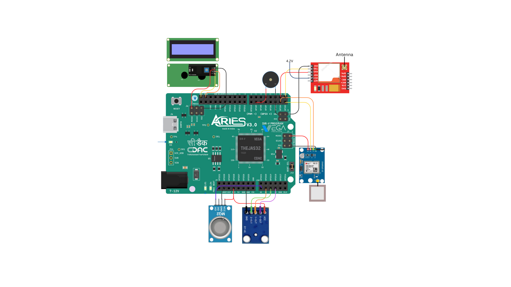

# SeismoSafe

## Introduction
SeismoSafe is an innovative system designed to detect seismic waves in real time and provide immediate alerts to enhance safety during and after earthquake events. By leveraging affordable components and advanced communication methods, this project offers a scalable and cost-effective solution for communities in earthquake-prone regions.

SeismoSafe not only detects seismic activity but also addresses post-earthquake hazards such as gas leaks and fires. With features like mesh networking, localized alerts, and emergency SOS communication, SeismoSafe aims to minimize risks and save lives.
## Overview
SeismoSafe integrates the following technologies to provide a comprehensive safety network:
- Real-Time Seismic Detection using the ADXL335 accelerometer.
- Local Alert Systems including audible buzzers and OLED displays.
- Mesh Networking for robust communication.
- Emergency Communication via GSM for sending SOS messages.
- Post-Earthquake Hazard Mitigation with MQ-2 gas sensors for gas leak detection.

The system processes sensor data locally, transmits it to neighboring nodes or a central hub, and triggers alarms when thresholds are exceeded. By providing both localized and centralized responses, SeismoSafe ensures effective and timely interventions.
## Components required with Bill of Materials

|Sl.no|Item|Quantity|Description|Links to Products|
|-----|----|--------|-----------|-----------------|
|1    |Vega Aries V3 RISC-V Board|1|RISC-V microcontroller development board|[Vega Aries V3 RISC-V Board](https://robu.in/product/aries-v30-devlopment-board/)  |
|2    |ADXL335 accelerometer module|1|3-axis analog accelerometer for motion sensing|[ADXL335 accelerometer module](https://robu.in/product/adxl335-module-3-axis-analog-output-accelerometer-raspberry-pi-arduino-avr/)  |
|3    |Buzzer|1|Produces sound for alerts |[Buzzer](https://robu.in/product/5v-active-electromagnetic-buzzer-pack-of-5/) |
|5    |MQ-2 Gas Sensor|1|Detects flammable gases and smoke|[MQ-2 Gas Sensor](https://robu.in/product/mq-2-mq2-smoke-gas-lpg-butane-hydrogen-gas-sensor-detector-module/)|
|6    |Neo-6M GPS Module|1|Provides GPS location data|[Neo-6M GPS Module](https://robu.in/product/neo-6m-gps-module-with-eprom-normal-quality/) |
|7    |SIM800L GSM Module|1|Enables GSM communication for SMS|[SIM800L GSM Module](https://robu.in/product/sim800l-v2-0-5v-wireless-gsm-gprs-module-quad-band/) |
|8    |LCD Display|1|Displays data using an LCD screen|[LCD Display Module](https://robu.in/product/jhd-16x2-character-lcd-display-with-blue-backlight/?gQT=1)|
|9    |Miscellaneous (LED's, Jumper Wire's, PCB)|-|||

## Table for Pin Connections

| Component**            | **VEGA Aries V3.0 Pin** | **Description**             |
|------------------------|------------------------|-----------------------------|
| **LCD Display**        | SDA1                   | I2C Data Line               |
|                   | SCL1                    | I2C Clock Line              |
| **Buzzer**        | GPIO9                  | Alarm indication       |
| **SIM800L GSM Module**    | RX1             | UART Communication (SIM TX → MCU RX) |
|                   |TX1                      | UART Communication (SIM RX → MCU TX) |
| **Gas Sensor**    | A0            | Analog signal output        |
| **GPS Module**    | RX                  | UART Communication (GPS TX → MCU RX) |
|                   | TX            | UART Communication (GPS RX → MCU TX) |

## Pinout Diagram


## Working Code

``` cpp
#include <Wire.h>
#include <LiquidCrystal_I2C.h>
#include <math.h>
#include <UARTClass.h>

// ADXL335 Accelerometer Pins
const int xPin = A0;
const int yPin = A1;
const int zPin = A2;

// Buzzer for alert
const int buzzerPin = 31;

// Sampling parameters
const float Fs = 20.0;
const float dt = 1.0 / Fs;

// STA-LTA Parameters
const int stw = 1 * Fs;
const int ltw = 10 * Fs;
const float threshold = 2.0;

#define bufferSize 2000
float acc_X[bufferSize] = {0};
float acc_Y[bufferSize] = {0};
float acc_Z[bufferSize] = {0};
float sta[bufferSize] = {0};
float lta[bufferSize] = {0};
float sra[bufferSize] = {0};

int index = 0;
bool pWaveDetected = false;

// LCD Initialization
TwoWire Wire(1);
LiquidCrystal_I2C lcd(0x27, 16, 2);

// UART for GSM and GPS
UARTClass Gsm(1); // UART1 for GSM
UARTClass Gps(2); // UART2 for GPS

void setup() {
  Serial.begin(230400);
  pinMode(buzzerPin, OUTPUT);
  digitalWrite(buzzerPin, LOW);

  lcd.init();
  lcd.backlight();
  lcd.clear();

  // Initialize GSM & GPS
  Gsm.begin(9600);
  Gps.begin(9600);
  
  Serial.println("Initializing System...");
}

float readADXL335(int pin) {
  int rawValue = analogRead(pin);
  float voltage = (rawValue / 1023.0) * 3.3;
  return (voltage - 1.65) / 0.330;
}

float highPassFilter(float input, float prevInput, float prevOutput, float alpha) {
  return alpha * (prevOutput + input - prevInput);
}

String getGPSCoordinates() {
  String gpsData = "";
  while (Gps.available()) {
    char c = Gps.read();
    gpsData += c;
    if (c == '\n') break; // End of NMEA sentence
  }
  
  // Extract Latitude & Longitude from GPGGA
  if (gpsData.indexOf("$GPGGA") != -1) {
    int latIndex = gpsData.indexOf(",") + 1;
    latIndex = gpsData.indexOf(",", latIndex) + 1;
    String latitude = gpsData.substring(latIndex, gpsData.indexOf(",", latIndex));
    
    int lonIndex = gpsData.indexOf(",", latIndex) + 1;
    lonIndex = gpsData.indexOf(",", lonIndex) + 1;
    String longitude = gpsData.substring(lonIndex, gpsData.indexOf(",", lonIndex));
    
    return "Lat: " + latitude + " Lon: " + longitude;
  }

  return "GPS No Fix";
}

void sendSMSAlert(String gpsLocation) {
  Gsm.println("AT+CMGF=1"); // Set SMS to text mode
  delay(500);
  Gsm.println("AT+CMGS=\"+91XXXXXXXXXX\""); // Replace with your number
  delay(500);
  Gsm.print("P-Wave Detected! Location: ");
  Gsm.print(gpsLocation);
  Gsm.write(26); // End SMS with Ctrl+Z
  delay(5000);
}

void loop() {
  while (1) {
    float raw_X = readADXL335(xPin);
    float raw_Y = readADXL335(yPin);
    float raw_Z = readADXL335(zPin);

    static float prev_X = 0, prev_Y = 0, prev_Z = 0;
    static float filtered_X = 0, filtered_Y = 0, filtered_Z = 0;
    float alpha = 0.8;

    filtered_X = highPassFilter(raw_X, prev_X, filtered_X, alpha);
    filtered_Y = highPassFilter(raw_Y, prev_Y, filtered_Y, alpha);
    filtered_Z = highPassFilter(raw_Z, prev_Z, filtered_Z, alpha);

    prev_X = raw_X;
    prev_Y = raw_Y;
    prev_Z = raw_Z;

    for (int i = bufferSize - 1; i > 0; i--) {
      acc_X[i] = acc_X[i - 1];
      acc_Y[i] = acc_Y[i - 1];
      acc_Z[i] = acc_Z[i - 1];
    }

    acc_X[0] = filtered_X;
    acc_Y[0] = filtered_Y;
    acc_Z[0] = filtered_Z;

    if (index >= ltw) {
      float staSum_X = 0, ltaSum_X = 0;
      float staSum_Y = 0, ltaSum_Y = 0;
      float staSum_Z = 0, ltaSum_Z = 0;

      for (int i = 0; i < stw; i++) {
        staSum_X += abs(acc_X[i]);
        staSum_Y += abs(acc_Y[i]);
        staSum_Z += abs(acc_Z[i]);
      }

      int safe_ltw = min(ltw, bufferSize);
      for (int i = 0; i < safe_ltw; i++) {
        ltaSum_X += abs(acc_X[i]);
        ltaSum_Y += abs(acc_Y[i]);
        ltaSum_Z += abs(acc_Z[i]);
      }

      sta[0] = (staSum_X / stw + staSum_Y / stw + staSum_Z / stw) / 3;
      lta[0] = (ltaSum_X / safe_ltw + ltaSum_Y / safe_ltw + ltaSum_Z / safe_ltw) / 3;
      sra[0] = sta[0] / lta[0];

      lcd.clear();
      lcd.setCursor(0, 0);
      lcd.print("SRA: ");
      lcd.print(sra[0], 2);

      if (sra[0] > threshold) {
        pWaveDetected = true;
        Serial.println("\xF0\x9F\x9A\xA8 P-Wave Detected! \xF0\x9F\x9A\xA8");
        digitalWrite(buzzerPin, HIGH);
        
        lcd.setCursor(0, 1);
        lcd.print("P-Wave Detected!");
        
        // Fetch GPS Coordinates
        String gpsLocation = getGPSCoordinates();
        Serial.println("Location: " + gpsLocation);
        
        lcd.clear();
        lcd.setCursor(0, 0);
        lcd.print("P-Wave Detected! Earthquake Alert!");
        lcd.setCursor(0, 1);
        lcd.print(gpsLocation);
        
        // Send SMS Alert with GPS Data
        sendSMSAlert(gpsLocation);

        delay(5);
        digitalWrite(buzzerPin, LOW);
      }
    }

    index++;
    if (index >= bufferSize) index = ltw;

    Serial.print("X:"); Serial.print(filtered_X);
    Serial.print(" Y:"); Serial.print(filtered_Y);
    Serial.print(" Z:"); Serial.print(filtered_Z);
    Serial.print(" SRA:"); Serial.println(sra[0]);

    delay(100);
  }
}
```

## Demo Video and Images


## Acknowledgements


